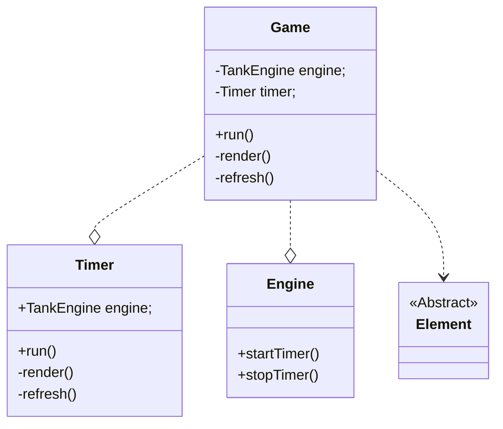
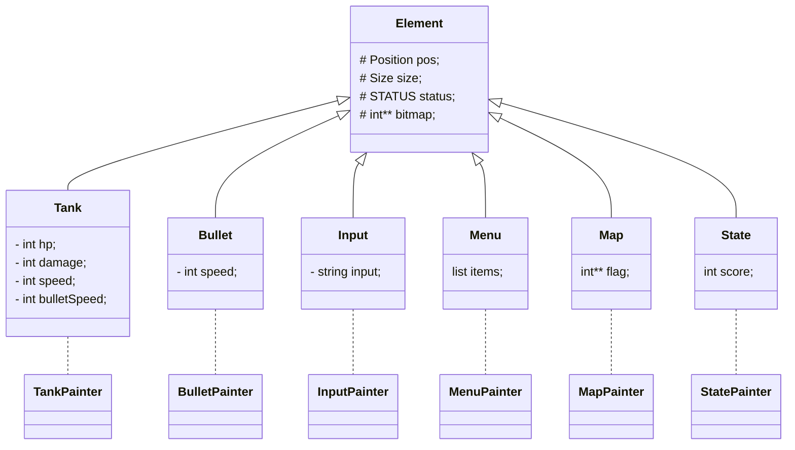
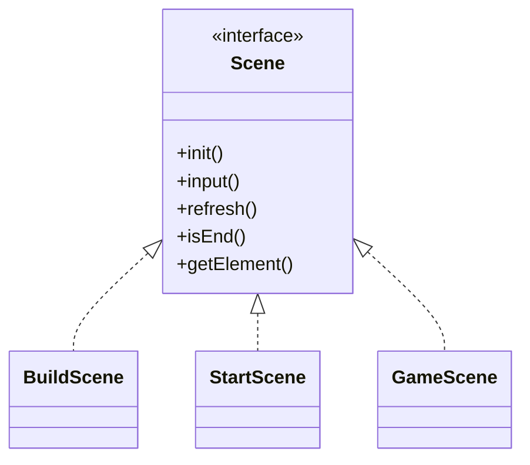

# TankGame

## 简述

- 采用cmake管理工程
- 采用GoogleTest作为单元测试框架
- 所有库中包括三个子目录
  - include：存放头文件
  - src：存放源代码
  - test：存放单元测试
- game工程依赖ncurses库、tank库
- game负责计时刷新和渲染元素
- tank库不依赖ncurses库，做到ui和游戏逻辑解耦
- tank库只暴露`engine.h`，标准化交互接口，方便动态库替换
- 算法优化，操作行为时间复杂度均不大于`O(n)`
- 输入字符转化成指令，传递给引擎解析
- 子弹连发会出现后一个子弹追上前一个子弹的问题, 当前采用方案: 限制子弹发射频率大于子弹速度
- 采用自定义结构存储数据，也可采用开源库和格式（如json、xml等）
- 只有xterm终端支持鼠标操作, 当前平台不支持鼠标，改用指令的方式设置地图（保留了鼠标操作的接口备用）
  - https://blog.csdn.net/weixin_31613447/article/details/117004508

## 可优化

- 坦克画笔类 写死了方向和位图关系，坦克的绘制可采用矩阵乘法
- 对三个子弹同时碰撞情况的处理，同时销毁三个子弹，而不是两个销毁，另一个不影响
- 两个坦克长按按钮情况下操作, 只有一个在移动 (命令行如何在一个按键按下的同时，继续接收其他的按键输入的问题)
- 当前坦克只能被子弹销毁，思考如何让坦克碰撞也销毁
- 一些容器可以用set代替list, 进而降低删除的时间复杂度
- 当前路径写死在代码中，可通过cmake编译时优化，将路径设置为可配置


## game工程类关系



- main负责run启动游戏
- 在构造和析构中初始化curses环境
- refresh负责在每个时钟刷新数据
- render负责渲染从引擎中得到的元素

## element & painter



- 负责记录元素的属性（大小，位置等）
- 每个元素有一个painter负责把Element的信息绘制成bitmap
- bitmap表示当前元素的绘制信息，render通过这个值打印每个element

### scene 场景



- 场景类似于窗口，管理一组元素，接收一组特定的输入
- 包括初始化、接收输入、刷新元素、是否结束、获取元素列表
- `init`负责初始化场景元素
- `input`负责接收来自用户的输入并操作元素中的数据
- `refresh`负责刷新每一帧，配合`Timer`让场景动起来
- `isEnd`负责判断当前场景是否满足结束条件
- `getElement`负责获取元素，提供统一元素接口


### handler 输入处理器

- 每个场景都对应一组有效输入，负责对场景的响应行为（可以独立出来，eg: game_hander.hpp）

### stage 舞台

  ```mermaid
  ---
  title: refresh主逻辑
  ---
  flowchart TB

    step1 --> step2
    step2 --> step3
    step3 --> step4
    step4 --> step5

    step1[updateTank]
    step2[updateBullet]
    step3[updateMap]
    step4[handleCollision]
    step5[tickMoveElement]
  ```

### action 行为
- 给出了公共行为 Move Touch

### Detector 碰撞检测

### io
- 负责加载文件中的游戏数据
- 关卡，存储&恢复，自定义地图都用到
